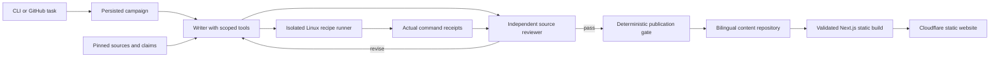
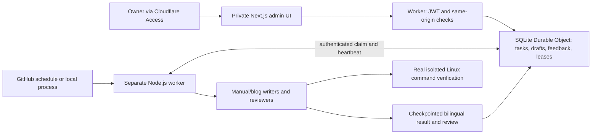

# Lavik Agent architecture · 0.1.0

## Product requirements

- English and Simplified Chinese have equal launch priority.
- Automatic publishing within configured rules starts immediately.
- Lavik is a new project with no customers. Use cases describe evaluation scenarios.
- The documentation family is 0.1.0; the pinned artifact is 0.1.0-beta.1.
- Accuracy precedes usefulness, clarity, cadence and reach.
- Writers reason from evidence, execute examples, inspect outcomes and revise.
- Derived claims are allowed with explicit premises and reproducible arithmetic.

## Implemented first increment

The public web application never runs an agent in a request or exposes operational state.
It renders escaped, structured blocks. Generated content cannot introduce MDX
execution, HTML, scripts, tool permissions, or unverified shell snippets.

The agent runtime and publisher are separate modules. The initial runtime uses the
TypeScript Agents SDK because its tools and local Docker verifier can be exercised
directly. `AgentRuntime` allows replacement by a managed API without moving the
business records into a provider conversation. Model names are explicit configuration.

Campaign state is checkpointed between steps, and attempts are recorded before
provider calls. Completed drafts and command receipts are saved before review, so a
failed review request resumes the saved draft without consuming another writing
attempt. Provider conversations interrupted during writing do not yet resume.
Local events record actual source reads, provider failures and reported token usage.
Review starts with the article, receipts and its referenced claims/source catalog
in a fresh context. The reviewer can inspect required sources in a single tool call,
preserving turns for arithmetic and its verdict. Using one deployment for both
roles preserves shared model limitations.
Per-campaign and publication locks prevent local concurrent writers.
Both editions pass before any article is made visible. Publication is append-only
for new campaign IDs, accepts identical retries, and rejects conflicting content.
A build must observe both editions and all evidence. These are filesystem guarantees
for one host; the implementation does not claim distributed exactly-once delivery.

CI deployments and campaign publication share a production concurrency group.
Ordinary CI skips deployment if its commit has been superseded on `main`; a campaign
must successfully push its content before deploying. GitHub Actions concurrency is
not a durable task queue: a newer pending run can replace an older pending run.
The admin queue now persists accepted tasks independently of CI.

## Private admin increment

`/admin/` and `/api/admin/*` require an Access JWT with the configured issuer,
audience and owner email. The runner API has a separate credential. Models and
Docker never execute in an HTTP request. No private task records enter the static
export or public GitHub artifacts.

The Durable Object serializes task transitions in SQLite transactions. Stable
request IDs deduplicate submission; a two-minute lease permits only one active task.
Heartbeats renew the lease, cancellation invalidates it, and late updates are rejected.
A lost worker leaves a failed task and saved draft rather than silently duplicating
model work. Revisions preserve their predecessors and accumulated owner feedback.
Role policies specialize documentation versus blog work; every writing task includes
fresh independent review of both locales. Review-only tasks inspect an existing article.

This updates the initial PostgreSQL/Workflows proposal for the v0.1 single-owner
project: SQLite Durable Objects provide durable state and atomic claims with the
existing Cloudflare deployment. The runner uses the existing Linux toolchain;
Cloudflare alarms dispatch it directly, with a GitHub schedule as backup. Portable task/evidence schemas preserve a migration
path to R2 artifacts, relational reporting and a persistent execution service.
Passing admin results enter a durable publication outbox in the same transaction.
A separate job validates their hashes, policy, source context and execution evidence,
commits the bilingual article, and deploys under the shared production concurrency
group. Publication is recorded only after its manifest and both content hashes are
verified on lavik.dev. Publisher leases, retries and immutable artifact identities
recover interrupted jobs without repeating model work. See [operations](admin.md).

## Evidence model

`Release → Sources → Claims → Articles → Reviews → Publications`

`Recipe + Harness + Release binary → Execution receipt → Article`

Sources have immutable upstream commit links and local SHA-256 checksums. Reviews
are tied to the exact structured article and knowledge-registry hash. Receipts bind
the recipe, harness, binary archive, source commit, version, container identity and
actual command output. The host checks the image's harness/recipe labels before
execution; it also compares returned commands and outputs against the current recipe.
Missing, failed, mismatched or unavailable evidence blocks the affected publication.

Model input includes the registered block renderers, calculator implementation,
startup script, verification harness and expected recipe/harness hashes. This lets
the reviewer inspect what a recipe or calculator block will actually show. Agent
reviews also bind the renderer/calculator hash; changing these files invalidates
those reviews at publication and build time.

The initial article corpus was curated and source-audited during implementation.
Those source-audit records are distinct from model review results. The real command
receipt is separate from either kind of editorial review. The build does not
reinterpret a source audit as proof of execution.

The reader sees source links, the precise release, benchmark conditions and optional
execution detail. Website facts are useful product information; operational prompts,
campaign logs, secrets and model routing stay private.

## Reasoning about cost

Supported measurement and derived conclusion are different evidence types. A
benchmark establishes throughput and latency for its recorded conditions. Combining
it with a price/capacity model can motivate an evaluation and estimate savings.
Inference does not require owner approval, but its premises must be visible.

For an explicitly scoped, equal-replica capacity comparison:

`Redis cost = shared cost + payload GiB × DRAM price/GiB`

`Lavik cost = shared cost + index/runtime GiB × DRAM price/GiB + payload GiB × storage amplification × SSD price/GiB`

The website's dimensionless scenario model exposes unit-price ratio, memory share and
shared cost. It assumes equal replicas and storage amplification 1; these assumptions
are stated, not reported as measured facts. A future deployment estimator should
include actual machine sizing, headroom, endurance, replication, support and pricing
date/region. An SLA includes workload-specific tail latency and availability/recovery;
it cannot be inferred from a single saturation-throughput comparison.

## Evolution path

1. Connect private reviewed drafts to versioned website publication with immutable
   article-scoped receipts, conflict detection and a transactional publication outbox.
2. Move large artifacts/transcripts to R2 as volume grows. Add PostgreSQL for reporting
   if needed while retaining portable schemas and explicit state ownership.
3. Replace GitHub wake-ups with Cloudflare Workflows or a persistent Linux service
   when scheduling requirements justify it. Preserve bounded retries and leases.
4. Implement channel adapters reporting their actual account capabilities. Keep
   API publication, import/export handoff, editing, deletion and metrics explicit.
5. Monitor releases and source changes. Create refresh campaigns from changed
   dependencies; never silently relabel old documents with a new product version.
6. Add measurement and skill evaluations. Compare factual accuracy, developer value,
   review corrections, adoption proxies, execution failures and owner effort.

Cloudflare Workflows and managed agent sessions are different layers: the former
coordinates business steps; the latter can perform bounded research/writing work.
Avoid overlapping orchestration systems without a specific need. Hosted state must
outlive provider log retention. Deployments and runtime upgrades need migration and
evaluation, not a promise that switching providers is a drop-in operation.

External publishing adapters must reconcile ambiguous timeouts before retrying.
Use a unique action identity per account/channel/content revision/publication intent;
record external IDs and read back results where the platform supports it. Keep
channel failures independent and route only unresolved exceptions to the owner.

## Current limits

The local workflow, public website, private admin console, durable queue, real verifier,
and CLI publication gate are implemented. Access and hosted execution need their
account settings described in [admin.md](admin.md). PostgreSQL, R2, Cloudflare Workflows,
a recurring editorial planner, external channel connections and adoption analytics
remain future increments. The model
adapter and orchestration have automated regression coverage. The
[first live Azure campaign](first-live-campaign.md) completed bilingual writing,
real command execution, independent review and local publication. One successful
pilot does not establish long-term autonomous reliability or editorial quality.
The recorded ARM64 environment was exercised locally, and GitHub Actions has also
passed real command verification using the x86_64 release on Ubuntu 24.04.
Ordinary CI stores its fresh receipts separately from reviewed publication evidence.
