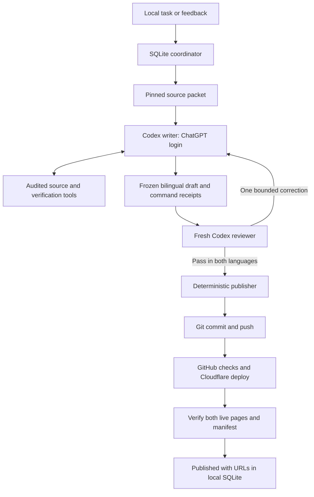

# Local Codex content team

Design dated September 21, 2026; implementation update September 26. The hosted
Admin and API-backed GitHub writing workflows remain disabled. The subscription
adapter, Docker verification, independent review, website publisher, two-day blog
schedule, and weekly channel reporting are implemented. See
[marketing operations](marketing-operations.md) for current commands and limits.
The initial coordinator uses locked, atomic JSON state rather than SQLite; the
dashboard, tool server, upstream watcher, and platform adapters below remain design
work. The public website and GitHub-to-Cloudflare deployment remain active.

## Decision

Run one TypeScript coordinator on the owner's Mac. It starts short-lived Codex CLI
sessions for writing and independent editorial review, then uses ordinary code to
publish the approved artifact. Keep task state in local SQLite and evidence in
ignored local files. Start with explicit task submission; add scheduling after
the first complete local publication works.

Codex supports ChatGPT subscription sign-in for local work. `codex exec` can reuse
the saved CLI login and return structured output plus machine-readable events.
This does not make inference offline: models still run on OpenAI's service and
use the account's Codex allowance. Limits and credits depend on the plan; reaching
a limit must pause the queue, with no automatic switch to an API key. See
[authentication](https://learn.chatgpt.com/docs/auth),
[non-interactive execution](https://learn.chatgpt.com/docs/non-interactive-mode),
and [usage limits](https://learn.chatgpt.com/docs/pricing).

The installed CLI was inspected without making a model request. It has a saved
ChatGPT login, but its user-level model provider is Azure. Therefore **login status
alone is insufficient to establish the billing route**. The new launcher must
ignore the inherited provider configuration, explicitly select the built-in
`openai` provider and require `forced_login_method="chatgpt"`. Keep the existing
global configuration unchanged. Provider selection belongs in the invocation;
project-local Codex config cannot override it. See the
[configuration reference](https://learn.chatgpt.com/docs/config-file/config-reference).

## Roles and boundaries

| Component            | Responsibility                                                                                           | Model usage                                                           |
| -------------------- | -------------------------------------------------------------------------------------------------------- | --------------------------------------------------------------------- |
| Local coordinator    | Queue, budgets, process supervision, checkpoints, feedback, scheduling                                   | None                                                                  |
| Content generator    | Manual/blog role instructions, English and Chinese drafts, cited sources, requests for verified examples | One fresh Codex session per bilingual draft                           |
| Independent reviewer | Verify both final editions, evidence, claims, calculations, release identity and translation consistency | Separate fresh Codex session; never resumes the writer's conversation |
| Verification service | Run registered commands against pinned Lavik in Docker Desktop; save actual outputs and hashes           | None                                                                  |
| Publisher            | Validate reviewed hashes, commit allowed files, push, watch CI, verify the live URLs                     | None for website delivery                                             |

Manual and blog writers remain distinct role presets. Their reviewers also have
distinct checklists. They share the same execution infrastructure and do not need
four resident model processes. Using the same model in separate sessions gives
process independence, not independence from that model's shared blind spots.



## Accuracy and execution evidence

Reuse the current article schemas, release lock, source registry, claim registry,
cost calculator, audited Docker harness, renderer fingerprints and publication
checks. Preserve versioned documentation and the exact upstream release identity.
Historical benchmarks retain their original measurement context.

The coordinator builds a small source packet for each task: the brief, applicable
role policy, selected article or destination, relevant source IDs and excerpts,
claim dependencies, and the renderer used for publication. It does not paste the
whole repository or all prior conversations into every invocation. Excerpts retain
source IDs and content hashes; agents can request the complete pinned sources.

A local stdio tool server exposes `read_source`, `calculate_cost`, and
`verify_example` using the existing trusted functions. Log actual source reads and
executions outside model output. Populate `checkedSourceIds` from those reads,
not from the reviewer's assertion. The writer can request a registered command
recipe, and the host executes it against real Lavik. A new arbitrary shell recipe
requires a reviewed repository change before joining that catalog.

Reuse execution receipts only when release artifact, recipe, harness, container
image and execution environment match and the task accepts their freshness. A
request for fresh execution always reruns it. An ARM64 smoke test is evidence for
that environment, not a reproduction of the x86_64 SPDK performance benchmark.
Both editions can reference the same matching recipe execution.

The reviewer receives the final article bytes, independently readable primary
evidence, recorded command results, and renderer definitions. It returns a verdict
and actionable findings for each locale. Both must pass without findings. Any
article, source, recipe, renderer or policy change invalidates the relevant approval.
The publisher never edits prose after approval and never treats a feedback comment
containing "approved" as an independent review.

## Codex invocation and credential handling

Use the installed `codex exec` initially; a small adapter translates its JSONL
events and final schema-constrained output into the existing result contracts.
Keep the adapter replaceable with Codex App Server later if interactive steering
and richer live status justify the additional integration.

The launcher must:

1. Verify saved ChatGPT authentication with a sanitized environment, without
   reading or displaying credential contents.
2. Use `--ignore-user-config`, `-c model_provider="openai"`, and
   `-c forced_login_method="chatgpt"`. Select the model and effort explicitly.
3. Build a child environment from an allowlist. Do not load `.env` or inherit
   Azure/OpenAI API keys, endpoint overrides, GitHub tokens or Cloudflare tokens.
4. Run in a clean per-task workspace containing only the required public source
   files and draft, with a read-only sandbox. The coordinator writes the returned
   article JSON. Wire only the audited local tools needed for that role.
5. Capture `--json` events and `--output-schema` results privately. Require a valid
   final result and successful process exit; progress text is not an article.
6. Start review as a new process/session. Resume a saved writer only for an
   explicit correction. Resume delivery from its saved artifact, without another
   writing or review session.

The local tool server is a trusted host process with narrowly defined operations;
the Codex shell sandbox does not constrain everything an MCP tool might do. Its
verifier must retain the existing container resource and network restrictions.
Read-only filesystem access by itself is not a confidentiality boundary. The
role's credential and tool boundaries must be enforced by the launcher, not merely
requested in the prompt. Keep deployment credentials in the separate publisher.

Use normal saved Codex sign-in on this Mac; do not extract session tokens or build
a client against private ChatGPT endpoints. No subscription credentials belong in
this public repository, GitHub Actions, or Cloudflare. Source text cannot authorize
new tools, new billing routes, or publication outside the agreed policy.

## Initial usage policy

These are proposed defaults for the new runner, not changes to the user's existing
Codex settings or a promise of a particular subscription cost.

| Setting                                      | Initial value                                                                                                 |
| -------------------------------------------- | ------------------------------------------------------------------------------------------------------------- |
| Model                                        | `gpt-6-astra` for both roles, if available through the ChatGPT account; otherwise stop for explicit selection |
| Writer reasoning                             | `medium`                                                                                                      |
| Reviewer reasoning                           | `high`                                                                                                        |
| Automatic model substitution or API fallback | Disabled                                                                                                      |
| Concurrent tasks                             | 1                                                                                                             |
| Typical bilingual task                       | 1 writer invocation + 1 reviewer invocation                                                                   |
| Automatic editorial correction               | At most 1 writer/reviewer correction pair                                                                     |
| Maximum model invocations per task           | 4, including format retries                                                                                   |
| Total task runtime                           | 45 minutes, then preserve state and stop                                                                      |
| Background generation                        | Off initially; only submitted tasks run                                                                       |
| Website publication                          | Automatic after passing checks, within existing rules                                                         |

An invocation may contain several model/tool turns. Four CLI invocations are not
four API requests or a fixed token charge. Record reported input, cached input,
output and reasoning usage when available. The coordinator should enforce a
configured aggregate task/day allowance at observable boundaries, plus process
timeouts; it must not advertise a perfect hard token cap for an in-flight request.
Expose usage and retries alongside task status. Stop on quota/authentication errors
instead of restarting in a tight loop or buying/using another billing route.

Use a weekly release/source watcher implemented as ordinary code. Only a relevant
diff or an explicit assignment creates a task. No model calls are needed to poll
GitHub, render a dashboard, idle, build the site, or publish unchanged approved copy.
Keep `xhigh` an explicit escalation for difficult work rather than the default for
formatting, translation or delivery. Separate future campaign planning into a
bounded scheduled task rather than a conversation among idle agents.

## Local state and user interface

Keep SQLite and private task artifacts under ignored `.runs/local/`. Persist
task IDs, parent revisions, briefs, feedback, stage attempts, model/effort, source
hashes, artifact hashes, usage events and publication receipts. Use transactional
claims and a process lock so restarts cannot create duplicate jobs.

Reuse the admin UI against a local Node API bound to `127.0.0.1`, with origin/CSRF
checks for mutations. Provide task assignment, drafts, findings, feedback, pause,
resume, usage and live URLs. Hosted Cloudflare Admin remains disabled. A later
read-only export can migrate old Cloudflare tasks; do not re-enable workers or
automatically replay the backlog during migration.

State flow:

```text
Queued → Writing → Verifying → Reviewing → Ready → Publishing → Deploying → Published
                              ↓
                      Changes requested → bounded correction or owner feedback

Any active stage → Paused / Waiting for quota / Failed, with saved progress
```

The Mac must be awake with internet access for model work. Docker Desktop must be
available for command verification. Add a macOS `launchd` user job only after the
manual path is tested. Wake-up can resume a saved queue; sleep cannot be advertised
as continuous agent execution. Once a commit is pushed, hosted website deployment
can complete while the Mac sleeps; its publisher reconciles the result on wake.

## Website and platform publication

Reuse `preparePublication`, immutable per-article receipts and
`verifyLivePublication`. Replace the Cloudflare task callback with local SQLite
updates. Make one commit containing both approved editions and sanitized evidence,
then push to `main` using the local owner's Git credentials. The existing model-free
CI workflow builds, verifies and deploys to Cloudflare. Track the exact content
commit; mark Published only when the live manifest and both page hashes match.
If deployment fails, retry delivery without invoking a model again.

For later X, Reddit, WeChat, Medium and Rednote delivery, add channel adapters that
take a reviewed publication and return an external post ID and URL. A Codex editor
can prepare platform-specific copy; new wording gets its own review. Credentials
remain in local credential storage, and each `(revision, channel, account)` has an
idempotent delivery record. Establish supported account integrations and community
rules before enabling an adapter. Keep an export/handoff path where supported
automatic posting is unavailable. Website publication is the first migration goal.

## Implementation sequence

1. Build a `CodexRuntime` adapter, subscription-only launcher/preflight and local
   evidence tool server. Test provider selection with mocked subprocesses before
   making any model request.
2. Add local SQLite coordination, explicit budgets and private checkpoint storage.
   Run one bilingual task with real commands and independent review.
3. Connect the deterministic publisher to ordinary GitHub website CI and verify
   a real Published result. Adapt the admin UI to the local API.
4. Add opt-in `launchd` scheduling, source-change tasks and individual platform
   adapters, with separate delivery state and usage accounting.

Acceptance requires that missing/expired subscription login stops before writing,
an inherited Azure configuration cannot route these tasks to Azure, a failed
command or unresolved finding cannot publish, review cannot inherit writer history,
and a deployment retry makes zero model calls. Mac restart must retain progress;
quota exhaustion must preserve the draft; Published must mean verified live content.
